## Spring

### 1、Spring简介

Spring 框架来创建性能好、易于测试、可重用的代码。

#### 1.1、Spring家族

项目列表：https://spring.io/projects

#### 1.2、Spring Framework

Spring 基础框架，可以视为 Spring 基础设施，基本上任何其他 Spring 项目都是以 Spring Framework

为基础的。

##### 1.3.1、Spring Framework特性

**非侵入式**：使用 Spring Framework 开发应用程序时，Spring 对应用程序本身的结构影响非常小。对领域模型可以做到零污染；对功能性组件也只需要使用几个简单的注解进行标记，完全不会破坏原有结构，反而能将组件结构进一步简化。这就使得基于 Spring Framework 开发应用程序时结构清晰、简洁优雅。

**控制反转**：IOC——Inversion of Control，翻转资源获取方向。把自己创建资源、向环境索取资源变成环境将资源准备好，我们享受资源注入。

**面向切面编程**：AOP——Aspect Oriented Programming，在不修改源代码的基础上增强代码功能。

**容器**：Spring IOC 是一个容器，因为它包含并且管理组件对象的生命周期。组件享受到了容器化的管理，替程序员屏蔽了组件创建过程中的大量细节，极大的降低了使用门槛，大幅度提高了开发效率。

**组件化**：Spring 实现了使用简单的组件配置组合成一个复杂的应用。在 Spring 中可以使用 XML和 Java 注解组合这些对象。这使得我们可以基于一个个功能明确、边界清晰的组件有条不紊的搭建超大型复杂应用系统。

**声明式**：很多以前需要编写代码才能实现的功能，现在只需要声明需求即可由框架代为实现。

**一站式**：在 IOC 和 AOP 的基础上可以整合各种企业应用的开源框架和优秀的第三方类库。而且Spring 旗下的项目已经覆盖了广泛领域，很多方面的功能性需求可以在 Spring Framework 的基础上全部使用 Spring 来实现。

##### 1.3.2、Spring Framework五大功能模块

| 功能模块                | 功能介绍                                                    |
| ----------------------- | ----------------------------------------------------------- |
| Core Container          | 核心容器，在 Spring 环境下使用任何功能都必须基于 IOC 容器。 |
| AOP&Aspects             | 面向切面编程                                                |
| Testing                 | 提供了对 junit 或 TestNG 测试框架的整合。                   |
| Data Access/Integration | 提供了对数据访问/集成的功能。                               |
| Spring MVC              | 提供了面向Web应用程序的集成功能。                           |

### 2、IOC

#### 2.1、IOC容器（Inversion of Control）

##### 2.1.1、IOC思想

反转控制

##### 2.1.2、IOC容器在Spring中实现

（1）BeanFactory

这是 IOC 容器的基本实现，是 Spring 内部使用的接口。面向 Spring 本身，不提供给开发人员使用。

（2）ApplicationContext

BeanFactory 的子接口，提供了更多高级特性。面向 Spring 的使用者，几乎所有场合都使用

ApplicationContext 而不是底层的 BeanFactory。

（3）ApplicationContext 的主要实现类

| **类型名**                      | **简介**                                                     |
| ------------------------------- | ------------------------------------------------------------ |
| ClassPathXmlApplicationContext  | 通过读取类路径下的 XML 格式的配置文件创建 IOC 容器对象       |
| FileSystemXmlApplicationContext | 通过文件系统路径读取 XML 格式的配置文件创建 IOC 容器对象     |
| ConfigurableApplicationContext  | ApplicationContext 的子接口，包含一些扩展方法refresh() 和 close() ，让 ApplicationContext 具有启动、关闭和刷新上下文的能力。 |
| WebApplicationContext           | 专门为 Web 应用准备，基于 Web 环境创建 IOC 容器对象，并将对象引入存入 ServletContext 域中。 |

#### 2.2基于XML管理bean

##### 2.2.1、入门案例

**①思路**

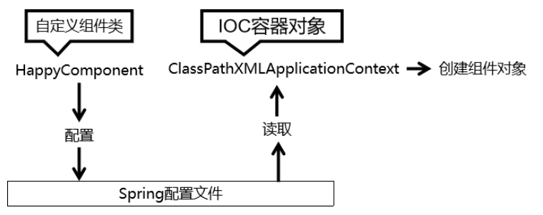

**②注意**

异常总结

org.springframework.beans.factory.**NoUniqueBeanDefinitionException**：违反唯一性约束，存在多个对象

org.springframework.beans.factory.**NoSuchBeanDefinitionException**：没有对象被发现，

##### 2.2.2、获取bean

①**方式一：根据id获取**

由于 id 属性指定了 bean 的唯一标识，所以根据 bean 标签的 id 属性可以精确获取到一个组件对象。

```java
public class HelloWorldTest {
    @Test
    public void sayHello() {
        //获取容器
        ApplicationContext ioc = new ClassPathXmlApplicationContext("applicationContext.xml");
        //获取ioc容器中的bean对象
        HelloWorld bean = (HelloWorld) ioc.getBean("helloWorld");
        bean.sayHello();
    }
}
```

**②方式二：根据类型获取**

```java
public class HelloWorldTest {
    @Test
    public void sayHello() {
        //获取容器
        ApplicationContext ioc = new ClassPathXmlApplicationContext("applicationContext.xml");
        //获取ioc容器中的bean对象
        HelloWorld bean = (HelloWorld) ioc.getBean(helloWorld.class);
        bean.sayHello();
    }
}
```

**③方式三：根据id和类型**

```java
public class HelloWorldTest {
    @Test
    public void sayHello() {
        //获取容器
        ApplicationContext ioc = new ClassPathXmlApplicationContext("applicationContext.xml");
        //获取ioc容器中的bean对象
        HelloWorld bean = (HelloWorld) ioc.getBean("helloWorld",helloWorld.class);
        bean.sayHello();
    }
}
```

④总结

```java
    /**
     * 获取bean的三种方式：
     * 1、根据bean的id获取
     * 2、根据bean的类型获取
     *   注意：根据类型获取bean时，要求IOC容器中有且只有一个类型匹配的bean
     *   若没有任何一个类型匹配的bean，此时抛出异常：org.springframework.beans.factory.NoSuchBeanDefinitionException
     *   若存在多个类型匹配的bean，此时抛出异常：org.springframework.beans.factory.NoUniqueBeanDefinitionException
     * 3、根据bean的id和类型获取
     * 结论：
     * 根据类型来获取bean时，在满足bean唯一性的前提下，其实只是看：『对象 instanceof 指定的类型』的返回结果，
     * 只要返回的是true就可以认定为和类型匹配，能够获取到。
     * 即通过bean的类型、bean所继承的类的类型、bean所实现的接口的类型都可以获取bean
     */
```


##### 2.2.3、依赖注入之setter注入

spring配置文件

```xml
<bean id="studentOne" class="com.tzadok.spring.bean.Student"> 
    <!-- property标签：通过组件类的setXxx()方法给组件对象设置属性 --> 
    <!-- name属性：指定属性名（这个属性名是getXxx()、setXxx()方法定义的，和成员变量无关） --> 
    <!-- value属性：指定属性值 --> 
    <property name="id" value="1001"></property> 
    <property name="name" value="张三"></property> 
    <property name="age" value="23"></property> 
    <property name="sex" value="男"></property> 
</bean>
```

##### 2.2.4、依赖注入之构造器注入

①实体类

```java
public Student(Integer sid, String name, String gender,Integer age) {
    this.sid = sid;
    this.name = name;
    this.gender = gender;
    this.age = age;
}
```

②spring文件配置

```xml
<bean id="studentThree" class="com.tzadok.spring.pojo.Student">
    <!--   通过构造器赋值     -->
    <constructor-arg value="1002"></constructor-arg>
    <constructor-arg value="花花"></constructor-arg>
    <constructor-arg value="女"></constructor-arg>
    <constructor-arg value="24" name="age"></constructor-arg>
</bean>
```

##### 2.2.5、特殊值处理

CDATA节

```xml
    <bean id="studentFour" class="com.tzadok.spring.pojo.Student">
        <property name="sid" value="1003"></property>
        <!--
            <:&lt;
            >:&gt;
            CDATA节其中的内容会原样解析<![CDATA[]]>
            CDATA是xml中一个特殊的标签，因此不能写在一个属性中
        -->
		<!-- <property name="name" value="&lt;桥本环奈&gt;"></property>-->
        <property name="name">
            <value><![CDATA[<桥本环奈>]]></value>
        </property>
        <property name="gender" >
            <null/>
        </property>
        <property name="age" value="23"></property>
    </bean>
```

##### 2.2.6、为类属性赋值

①外部bean

```xml
<bean id="clazzOne" class="com.tzadok.spring.bean.Clazz"> 
    <property name="clazzId" value="1111">
    </property> <property name="clazzName" value="财源滚滚班">
    </property> 
</bean>
```

```xml
<bean id="studentFour" class="com.tzadok.spring.bean.Student"> 
    <property name="id" value="1004"></property> 
    <property name="name" value="赵六"></property> 
    <property name="age" value="26"></property> 
    <property name="sex" value="女"></property> 
    <!-- ref属性：引用IOC容器中某个bean的id，将所对应的bean为属性赋值 -->
    <property name="clazz" ref="clazzOne">
    </property> 
</bean>
```

②内部bean

```xml
<bean id="studentFour" class="com.tzadok.spring.bean.Student"> 
    <property name="id" value="1004"></property> 
    <property name="name" value="赵六"></property> 
    <property name="age" value="26"></property> 
    <property name="sex" value="女"></property> 
    <property name="clazz"> 
        <!-- 在一个bean中再声明一个bean就是内部bean --> 
        <!-- 内部bean只能用于给属性赋值，不能在外部通过IOC容器获取，因此可以省略id属性 --> 
        <bean id="clazzInner" class="com.tzadok.spring.bean.Clazz"> 
            <property name="clazzId" value="2222"></property> 
            <property name="clazzName" value="远大前程班">
            </property> 
        </bean> 
    </property> 
</bean>
```

③级联属性

```xml
<bean id="studentFour" class="com.tzadok.spring.bean.Student"> 
    <property name="id" value="1004"></property> 
    <property name="name" value="赵六"></property> 
    <property name="age" value="26"></property> 
    <property name="sex" value="女"></property> 
    <!-- 一定先引用某个bean为属性赋值，才可以使用级联方式更新属性 --> 
    <property name="clazz" ref="clazzOne"></property> 
    <property name="clazz.clazzId" value="3333"></property> 
    <property name="clazz.clazzName" value="最强王者班"></property>
</bean>
```

##### **2.2.7**、为数组类型属性赋值

```xml
<bean id="studentFour" class="com.tzadok.spring.bean.Student"> 
    <property name="id" value="1004"></property> 
    <property name="name" value="赵六"></property>
    <property name="age" value="26"></property> 
    <property name="sex" value="女"></property> 
    <!-- ref属性：引用IOC容器中某个bean的id，将所对应的bean为属性赋值 -->
    <property name="clazz" ref="clazzOne"></property> 
    <property name="hobbies"> 
        <array> 
            <value>抽烟</value> 
            <value>喝酒</value> 
            <value>烫头</value> 
        </array> 
    </property> 
</bean>
```

##### **2.2.8**、为集合类型属性赋值

①为Map集合类型属性赋值

```xml
<bean id="teacherOne" class="com.tzadok.spring.bean.Teacher"> 
    <property name="teacherId" value="10010"></property> 
    <property name="teacherName" value="大宝"></property> 
</bean> 

<bean id="teacherTwo" class="com.tzadok.spring.bean.Teacher"> 
    <property name="teacherId" value="10086"></property> 
    <property name="teacherName" value="二宝"></property> 
</bean> 

<bean id="studentFour" class="com.tzadok.spring.bean.Student"> 
    <property name="id" value="1004"></property> 
    <property name="name" value="赵六"></property> 
    <property name="age" value="26"></property> 
    <property name="sex" value="女"></property> 
    <!-- ref属性：引用IOC容器中某个bean的id，将所对应的bean为属性赋值 --> 
    <property name="clazz" ref="clazzOne"></property> 
    <property name="hobbies"> 
        <array> 
            <value>抽烟</value> 
            <value>喝酒</value> 
            <value>烫头</value> 
        </array> 
    </property> 
    <property name="teacherMap"> 
        <map>
            <entry> 
                <key><value>10010</value> 
                </key> <ref bean="teacherOne"></ref> 
            </entry> 
            <entry> 
                <key><value>10086</value> 
                </key> <ref bean="teacherTwo"></ref> 
            </entry> 
        </map> 
    </property> 
</bean>
```

②引用集合类型的bean

```xml
<!--list集合类型的bean--> 
<util:list id="students"> 
    <ref bean="studentOne"></ref> 
    <ref bean="studentTwo"></ref> 
    <ref bean="studentThree"></ref> 
</util:list> 

<!--map集合类型的bean--> 
<util:map id="teacherMap"> 
    <entry> 
        <key><value>10010</value> 
        </key> <ref bean="teacherOne"></ref> 
    </entry> 
    <entry> 
        <key><value>10086</value> 
        </key> <ref bean="teacherTwo"></ref> 
    </entry> 
</util:map>
<bean id="clazzTwo" class="com.tzadok.spring.bean.Clazz"> 
    <property name="clazzId" value="4444"></property>
    <property name="clazzName" value="Javaee0222"></property> 
    <property name="students" ref="students"></property> 
</bean> 
<bean id="studentFour" class="com.tzadok.spring.bean.Student">
    <property name="id" value="1004"></property> 
    <property name="name" value="赵六"></property> 
    <property name="age" value="26"></property> 
    <property name="sex" value="女"></property> 
    <!-- ref属性：引用IOC容器中某个bean的id，将所对应的bean为属性赋值 -->
    <property name="clazz" ref="clazzOne"></property> 
    <property name="hobbies"> 
        <array> 
            <value>抽烟</value> 
            <value>喝酒</value> 
            <value>烫头</value> 
        </array> 
    </property> 
    <property name="teacherMap" ref="teacherMap"></property>
</bean>
```

##### 2.2.9、p命名空间

```xml
<bean id="studentSix" class="com.tzadok.spring.bean.Student" 
      p:id="1006"
      p:name="小明" 
      p:clazz-ref="clazzOne" 
      p:teacherMap- ref="teacherMap">
</bean>
```

##### 2.2.10、引入外部属性文件

①引入依赖

```xml
<!-- MySQL驱动 --> 
<dependency> 
    <groupId>mysql</groupId> 
    <artifactId>mysql-connector-java</artifactId> 
    <version>8.0.16</version> 
</dependency> 
<!-- 数据源 --> 
<dependency> 
    <groupId>com.alibaba</groupId> 
    <artifactId>druid</artifactId> 
    <version>1.0.31</version> 
</dependency>
```

②创建外部文件

```xml
jdbc.driver=com.mysql.cj.jdbc.Driver
jdbc.url=jdbc:mysql://localhost:3306/ssm?serverTimezone=UTC
jdbc.username=root
jdbc.password=000000
```

③引入属性文件

```xml
<!-- 引入外部属性文件 --> 
<context:property-placeholder location="classpath:jdbc.properties"/>
```

④配置bean文件

```xml
<bean id="druidDataSource" class="com.alibaba.druid.pool.DruidDataSource"> 
    <property name="url" value="${jdbc.url}"/> 
    <property name="driverClassName" value="${jdbc.driver}"/> 
    <property name="username" value="${jdbc.user}"/> 
    <property name="password" value="${jdbc.password}"/> 
</bean>
```

⑤测试

```java
@Test 
public void testDataSource() throws SQLException { 
    ApplicationContext ac = new ClassPathXmlApplicationContext("spring- datasource.xml"); 		DataSource dataSource = ac.getBean(DataSource.class); 
    Connection connection = dataSource.getConnection(); 
    System.out.println(connection); 
}
```

##### 2.2.11、bean的作用域

**概念**

在Spring中可以通过配置bean标签的scope属性来指定bean的作用域范围，各取值含义参加下表：

| 取值              | 含义                                    | 创建对象的时机  |
| ----------------- | --------------------------------------- | --------------- |
| singleton（默认） | 在IOC容器中，这个bean的对象始终为单实例 | IOC容器初始化时 |
| prototype         | 这个bean在IOC容器中有多个实例           | 获取bean时      |

如果是在WebApplicationContext环境下还会有另外两个作用域（但不常用）：

| 取值    | 含义                 |
| ------- | -------------------- |
| request | 在一个请求范围内有效 |
| session | 在一个会话范围内有效 |

##### 2.2.12、bean的生命周期

①具体的生命周期过程

bean对象创建（调用无参构造器）

给bean对象设置属性

bean对象初始化之前操作（由bean的后置处理器负责）

bean对象初始化（需在配置bean时指定初始化方法）

bean对象初始化之后操作（由bean的后置处理器负责）

bean对象就绪可以使用

bean对象销毁（需在配置bean时指定销毁方法）

IOC容器关闭

②总结

```java
    /**
     * bean的生命周期
     * 1、实例化
     * 2、依赖注入
     * 3、后置处理器的postProcessBeforeInitialization
     * 4、初始化,需要通过bean的init-method属性指定初始化的方法
     * 5、后置处理器的postProcessAfterInitialization
     * 6、IOC容器关闭时销毁，需要通过bean的destroy-method属性指定销毁的方法
     *
     * bean的后置处理器会在生命周期的初始化前后添加额外的操作，需要实现BeanPostProcessor接口，且配置到IOC容器中，
     * 需要注意的是，bean后置处理器不是单独针对某一个bean生效，而是针对IOC容器中所有bean都会执行
     *
     * 注意：
     * 若bean的作用域为单例时，生命周期的前三个步骤会在获取IOC容器时执行
     * 若bean的作用域为多例时，生命周期的前三个步骤不会在获取IOC容器时执行，会在获取bean时执行
     */

    /**
     * ApplicationContext中并没有提供关闭容器的方法
     * ConfigurableApplicationContext中提供了关闭容器的方法
     *
     * ConfigurableApplicationContext是ApplicationContext的子接口，其中扩展了刷新和关闭容器的方法
     */
```


##### 2.2.13、FactoryBean

**①简介**

FactoryBean是Spring提供的一种整合第三方框架的常用机制。和普通的bean不同，配置一个

FactoryBean类型的bean，在获取bean的时候得到的并不是class属性中配置的这个类的对象，而是

getObject()方法的返回值。通过这种机制，Spring可以帮我们把复杂组件创建的详细过程和繁琐细节都

屏蔽起来，只把最简洁的使用界面展示给我们。

将来我们整合Mybatis时，Spring就是通过FactoryBean机制来帮我们创建SqlSessionFactory对象的。

```java
/*
 * Copyright 2002-2020 the original author or authors.
 *
 * Licensed under the Apache License, Version 2.0 (the "License");
 * you may not use this file except in compliance with the License.
 * You may obtain a copy of the License at
 *
 *      https://www.apache.org/licenses/LICENSE-2.0
 *
 * Unless required by applicable law or agreed to in writing, software
 * distributed under the License is distributed on an "AS IS" BASIS,
 * WITHOUT WARRANTIES OR CONDITIONS OF ANY KIND, either express or implied.
 * See the License for the specific language governing permissions and
 * limitations under the License.
 */

package org.springframework.beans.factory;

import org.springframework.lang.Nullable;

/**
 * Interface to be implemented by objects used within a {@link BeanFactory} which
 * are themselves factories for individual objects. If a bean implements this
 * interface, it is used as a factory for an object to expose, not directly as a
 * bean instance that will be exposed itself.
 *
 * <p><b>NB: A bean that implements this interface cannot be used as a normal bean.</b>
 * A FactoryBean is defined in a bean style, but the object exposed for bean
 * references ({@link #getObject()}) is always the object that it creates.
 *
 * <p>FactoryBeans can support singletons and prototypes, and can either create
 * objects lazily on demand or eagerly on startup. The {@link SmartFactoryBean}
 * interface allows for exposing more fine-grained behavioral metadata.
 *
 * <p>This interface is heavily used within the framework itself, for example for
 * the AOP {@link org.springframework.aop.framework.ProxyFactoryBean} or the
 * {@link org.springframework.jndi.JndiObjectFactoryBean}. It can be used for
 * custom components as well; however, this is only common for infrastructure code.
 *
 * <p><b>{@code FactoryBean} is a programmatic contract. Implementations are not
 * supposed to rely on annotation-driven injection or other reflective facilities.</b>
 * {@link #getObjectType()} {@link #getObject()} invocations may arrive early in the
 * bootstrap process, even ahead of any post-processor setup. If you need access to
 * other beans, implement {@link BeanFactoryAware} and obtain them programmatically.
 *
 * <p><b>The container is only responsible for managing the lifecycle of the FactoryBean
 * instance, not the lifecycle of the objects created by the FactoryBean.</b> Therefore,
 * a destroy method on an exposed bean object (such as {@link java.io.Closeable#close()}
 * will <i>not</i> be called automatically. Instead, a FactoryBean should implement
 * {@link DisposableBean} and delegate any such close call to the underlying object.
 *
 * <p>Finally, FactoryBean objects participate in the containing BeanFactory's
 * synchronization of bean creation. There is usually no need for internal
 * synchronization other than for purposes of lazy initialization within the
 * FactoryBean itself (or the like).
 *
 * @author Rod Johnson
 * @author Juergen Hoeller
 * @since 08.03.2003
 * @param <T> the bean type
 * @see org.springframework.beans.factory.BeanFactory
 * @see org.springframework.aop.framework.ProxyFactoryBean
 * @see org.springframework.jndi.JndiObjectFactoryBean
 */
public interface FactoryBean<T> {

	/**
	 * The name of an attribute that can be
	 * {@link org.springframework.core.AttributeAccessor#setAttribute set} on a
	 * {@link org.springframework.beans.factory.config.BeanDefinition} so that
	 * factory beans can signal their object type when it can't be deduced from
	 * the factory bean class.
	 * @since 5.2
	 */
	String OBJECT_TYPE_ATTRIBUTE = "factoryBeanObjectType";


	/**
	 * Return an instance (possibly shared or independent) of the object
	 * managed by this factory.
	 * <p>As with a {@link BeanFactory}, this allows support for both the
	 * Singleton and Prototype design pattern.
	 * <p>If this FactoryBean is not fully initialized yet at the time of
	 * the call (for example because it is involved in a circular reference),
	 * throw a corresponding {@link FactoryBeanNotInitializedException}.
	 * <p>As of Spring 2.0, FactoryBeans are allowed to return {@code null}
	 * objects. The factory will consider this as normal value to be used; it
	 * will not throw a FactoryBeanNotInitializedException in this case anymore.
	 * FactoryBean implementations are encouraged to throw
	 * FactoryBeanNotInitializedException themselves now, as appropriate.
	 * @return an instance of the bean (can be {@code null})
	 * @throws Exception in case of creation errors
	 * @see FactoryBeanNotInitializedException
	 */
	@Nullable
	T getObject() throws Exception;

	/**
	 * Return the type of object that this FactoryBean creates,
	 * or {@code null} if not known in advance.
	 * <p>This allows one to check for specific types of beans without
	 * instantiating objects, for example on autowiring.
	 * <p>In the case of implementations that are creating a singleton object,
	 * this method should try to avoid singleton creation as far as possible;
	 * it should rather estimate the type in advance.
	 * For prototypes, returning a meaningful type here is advisable too.
	 * <p>This method can be called <i>before</i> this FactoryBean has
	 * been fully initialized. It must not rely on state created during
	 * initialization; of course, it can still use such state if available.
	 * <p><b>NOTE:</b> Autowiring will simply ignore FactoryBeans that return
	 * {@code null} here. Therefore it is highly recommended to implement
	 * this method properly, using the current state of the FactoryBean.
	 * @return the type of object that this FactoryBean creates,
	 * or {@code null} if not known at the time of the call
	 * @see ListableBeanFactory#getBeansOfType
	 */
	@Nullable
	Class<?> getObjectType();

	/**
	 * Is the object managed by this factory a singleton? That is,
	 * will {@link #getObject()} always return the same object
	 * (a reference that can be cached)?
	 * <p><b>NOTE:</b> If a FactoryBean indicates to hold a singleton object,
	 * the object returned from {@code getObject()} might get cached
	 * by the owning BeanFactory. Hence, do not return {@code true}
	 * unless the FactoryBean always exposes the same reference.
	 * <p>The singleton status of the FactoryBean itself will generally
	 * be provided by the owning BeanFactory; usually, it has to be
	 * defined as singleton there.
	 * <p><b>NOTE:</b> This method returning {@code false} does not
	 * necessarily indicate that returned objects are independent instances.
	 * An implementation of the extended {@link SmartFactoryBean} interface
	 * may explicitly indicate independent instances through its
	 * {@link SmartFactoryBean#isPrototype()} method. Plain {@link FactoryBean}
	 * implementations which do not implement this extended interface are
	 * simply assumed to always return independent instances if the
	 * {@code isSingleton()} implementation returns {@code false}.
	 * <p>The default implementation returns {@code true}, since a
	 * {@code FactoryBean} typically manages a singleton instance.
	 * @return whether the exposed object is a singleton
	 * @see #getObject()
	 * @see SmartFactoryBean#isPrototype()
	 */
	default boolean isSingleton() {
		return true;
	}

}

```

①创建类UserFactoryBean

```java
public class UserFactoryBean implements FactoryBean<User> {
    @Override
    public User getObject() throws Exception {
        return new User();
    }

    @Override
    public Class<?> getObjectType() {
        return User.class;
    }
}
```

②配置bean

```xml
<bean class="com.tzadok.spring.factory.UserFactoryBean"></bean>
```

##### 2.2.14、基于xml的自动装配

自动装配：

根据指定的策略，在IOC容器中匹配某一个bean，自动为指定的bean中所依赖的类类型或接口类

型属性赋值

①场景模拟

创建UserController

```java
public class UserController {

    private UserService userService;

    public UserService getUserService() {
        return userService;
    }

    public void setUserService(UserService userService) {
        this.userService = userService;
    }

    public void saveUser(){
        userService.saveUser();
    }
}
```

创建UserService

```java
public interface UserService {

    /**
     * 添加用户信息
     */
    void saveUser();
}
```

创建UserServiceImpl

```java
public class UserServiceImpl implements UserService {

    private UserDao userDao;

    public UserDao getUserDao() {
        return userDao;
    }

    public void setUserDao(UserDao userDao) {
        this.userDao = userDao;
    }

    @Override
    public void saveUser() {
        userDao.saveUser();
    }
}
```

创建UserDao

```java
public interface UserDao {

    /**
     * 保存用户信息
     */
    void saveUser();
}
```

创建UserDaoImpl

```java
public class UserDaoImpl implements UserDao {
    @Override
    public void saveUser() {
        System.out.println("保存成功");
    }
}
```

②配置bean

使用bean标签的autowire属性设置自动装配效果

自动装配方式：byType

byType：根据类型匹配IOC容器中的某个兼容类型的bean，为属性自动赋值

若在IOC中，没有任何一个兼容类型的bean能够为属性赋值，则该属性不装配，即值为默认值null

若在IOC中，有多个兼容类型的bean能够为属性赋值，则抛出异常	NoUniqueBeanDefinitionException

```xml
    <!-- controller配置   -->
    <bean id="userController" class="com.tzadok.spring.controller.UserController" autowire="byType">
<!--        <property name="userService" ref="userService"></property>-->
    </bean>

    <!--  userService实现类  -->
    <bean id="userService" class="com.tzadok.spring.service.impl.UserServiceImpl" autowire="byType">
<!--        <property name="userDao" ref="userDao"></property>-->
    </bean>

    <!-- userDao实现类   -->
    <bean id="userDao" class="com.tzadok.spring.dao.impl.UserDaoImpl"></bean>
```

自动装配方式：byName

byName：将自动装配的属性的属性名，作为bean的id在IOC容器中匹配相对应的bean进行赋值

```xml
<bean id="userController" class="com.tzadok.autowire.xml.controller.UserController" autowire="byName"> </bean> 

<bean id="userService" class="com.tzadok.autowire.xml.service.impl.UserServiceImpl" autowire="byName"> </bean> 

<bean id="userServiceImpl" class="com.tzadok.autowire.xml.service.impl.UserServiceImpl" autowire="byName"> </bean> 

<bean id="userDao" class="com.tzadok.autowire.xml.dao.impl.UserDaoImpl"></bean> 

<bean id="userDaoImpl" class="com.tzadok.autowire.xml.dao.impl.UserDaoImpl"> </bean>
```

③测试

```java
    @Test
    public void testAutowireByXML(){
        ApplicationContext context = new ClassPathXmlApplicationContext("spring-autowire-xml.xml");

        UserController userController = context.getBean(UserController.class);

        userController.saveUser();
    }
```

④总结

```java
    /**
     * 自动装配：
     * 根据指定的策略，在IOC容器中匹配某个bean，自动为bean中的类类型的属性或接口类型的属性赋值
     * 可以通过bean标签中的autowire属性设置自动装配的策略
     *
     * 自动装配的策略：
     * 1、no、default:表示不装配，即bean中的属性不会自动匹配某个bean为属性赋值，此时属性使用默认值
     *
     * 2、byType：根据要赋值的属性的类型，在IOC容器中匹配某个bean，为属性赋值
     * 注意：
     * a>若通过类型没有找到任何一个类型匹配的bean，此时不装配，属性使用默认值
     * b>若通过类型找到了多个类型匹配的bean，此时会抛出异常：NoUniqueBeanDefinitionException
     * 总结:当使用byType实现自动装配时，IOV容器中有且只有一个类型匹配的bean能够为属性赋值
     *
     * 3、byName:将要赋值的属性的属性名作为bean的id在IOC容器中匹配某个bean，为属性赋值
     * 总结：当类型匹配的bean有多个时，此时key使用byName实现自动装配
     */
```

#### 2.3、基于注解管理bean

##### 2.3.1、**标记与扫描**

①概念和常用组件

在类中打上标记，通过扫描来进行检测。然后根据注解进行后续操作。

**标记组件的常用组件**

@Component：将类标识为普通组件 

@Controller：将类标识为控制层组件 

@Service：将类标识为业务层组件 

@Repository：将类标识为持久层组件

通过查看源码我们得知，@Controller、@Service、@Repository这三个注解只是在@Component注解的基础上起了三个新的名字。

对于Spring使用IOC容器管理这些组件来说没有区别。所以@Controller、@Service、@Repository这三个注解只是给开发人员看的，让我们能够便于分辨组件的作用。

**注意：虽然它们本质上一样，但是为了代码的可读性，为了程序结构严谨我们肯定不能随便胡乱标记。**

②扫描组件

情况一：最基本的扫描方式

```xml
<context:component-scan base-package="com.tzadok"> </context:component-scan>
```

情况二：指定要排除的组件

```xml
<context:component-scan base-package="com.tzadok"> 
    <!-- context:exclude-filter标签：指定排除规则 --> 
    <!--type：设置排除或包含的依据 
		type="annotation"，根据注解排除，
		expression中设置要排除的注解的全类名 
		type="assignable"，根据类型排除，
		expression中设置要排除的类型的全类名 --> 
    <context:exclude-filter type="annotation" expression="org.springframework.stereotype.Controller"/> 
    <!--<context:exclude-filter type="assignable" expression="com.tzadok.controller.UserController"/>--> 
</context:component-scan>
```

情况三：仅扫描指定组件

```xml
<context:component-scan base-package="com.tzadok" use-default-filters="false"> 
    <!-- context:include-filter标签：指定在原有扫描规则的基础上追加的规则 --> 
    <!-- use-default-filters属性：取值false表示关闭默认扫描规则 --> 
    <!-- 此时必须设置use-default-filters="false"，因为默认规则即扫描指定包下所有类 --> 
    <!--type：设置排除或包含的依据 type="annotation"，根据注解排除，
    expression中设置要排除的注解的全类名 type="assignable"，根据类型排除，
    expression中设置要排除的类型的全类名 --> 
    <context:include-filter type="annotation" expression="org.springframework.stereotype.Controller"/> 
    <!--<context:include-filter type="assignable" expression="com.tzadok.controller.UserController"/>--> 
</context:component-scan>
```

③组件所对应的bean的id

在我们使用XML方式管理bean的时候，每个bean都有一个唯一标识，便于在其他地方引用。现在使用

注解后，每个组件仍然应该有一个唯一标识。

默认情况

类名首字母小写就是bean的id。例如：UserController类对应的bean的id就是userController。

自定义bean的id

可通过标识组件的注解的value属性设置自定义的bean的id

@Service("userService")

//默认为userServiceImpl 

public class UserServiceImpl implements UserService {

}

##### 2.3.2、基于注解的自动装配

①@Autowired注解

a>在成员变量上直接标记@Autowired注解即可完成自动装配，不需要提供setXxx()方法。以后我们在项

目中的正式用法就是这样。

```java
@Controller
public class UserController {

    @Autowired
    private UserService userService;
}
```

b>@Autowired注解可以标记在构造器

```java
@Controller
public class UserController {
    @Autowired
    public UserController(UserService userService) {
            this.userService = userService;
    }
}
```

c>@Autowired注解可以标记在set方法

```java
@Controller
public class UserController {
    @Autowired
    public void setUserService(UserService userService) {
        this.userService = userService;
    }
}
```

②@Autowired工作流程

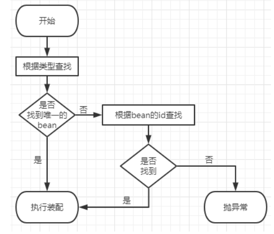

③总结

```java
/**
     * @Component：将类标识为普通组件
     * @Controller：将类标识为控制层组件
     * @Service：将类标识为业务层组件
     * @Repository：将类标识为持久层组件
     *
     * 通过注解—+扫描所配置的bean的id，默认为类的小驼峰，即类名的首字母为小写的结果
     * 自定义id：可以通过标识组件的注解的value的属性值设置bean的自定义的id
     *
     * @Autowired:实现自动装配功能的注解
     * 1、@Autowired注解能够标识的位置
     * a>标识在成员变量上，此时不需要设置成员变量的set方法
     * b>标识在set方法上
     * c>为当前成员变量赋值的的有参构造上
     * 2、@Autowired注解的原理
     * a>默认通过byType的方式，在IOC容器中通过类型匹配某个bean为属性赋值
     * b>若有多个类型匹配的bean，此时会自动转换为byName的方式实现自动装配的效果
     *   即将要赋值的属性的属性名作为bean的id匹配某个bean为属性赋值
     * c>若byType和byName的方式都无妨实现自动装配，即IOC有多个类型匹配的bean
     *   且这些bean的id和要赋值的属性的属性名都不一致，此时抛出异常NoUniqueBeanDefinitionException
     * d>此时可以在要赋值的属性上，添加一个注解@Qualifier("userServiceImpl")
     *   通过该注解的value属性值，指定某个bean的id，将为这个bean为属性赋值
     *
     *  注意：若IOC容器中没有任何一个类型匹配的bean，此时抛出NoSuchBeanDefinitionException
     *  在@Autowired注解中有个属性required，默认值为true，要求必须完成自动装配
     *  可以将required设置为false，此时能装配，无法装配则使用属性的默认值
     *
     *  NoSuchBeanDefinitionException：在自动装配过程中，有一个类未完成自动装配
     *  No qualifying bean of type 'com.tzadok.spring.service.UserService'会提示在哪个类里面没有完成自动装配
     *
     */
```

### 3、AOP

#### 3.1场景模拟

##### 3.1.1、场景介绍

做一个计算器，功能包含 加减乘除，但要在业务逻辑上面加上日志功能，譬如

```java
@Override 
public int sub(int i, int j) { 
    System.out.println("[日志] sub 方法开始了，参数是：" + i + "," + j); 
    int result = i - j; 
    System.out.println("方法内部 result = " + result); 
    System.out.println("[日志] sub 方法结束了，结果是：" + result); return result; 
}
```

##### 3.1.2、提出问题

针对日志功能，发现如下缺陷：

- 对核心业务功能有干扰，导致程序员在开发核心业务功能时分散了精力
- 附加功能分散在各个业务功能方法中，不利于统一维护

##### 3.1.3、解决问题--解耦

将日志功能抽取出来，使得业务逻辑的代码清晰可见，便于管理

#### 3.2、代理模式

##### 3.2.1、概念

**①介绍**

二十三种设计模式中的一种，属于结构型模式。它的作用就是通过提供一个代理类，让我们在调用目标方法的时候，不再是直接对目标方法进行调用，而是通过代理类**间接**调用。让不属于目标方法核心逻辑的代码从目标方法中剥离出来——**解耦**。调用目标方法时先调用代理对象的方法，减少对目标方法的调用和打扰，同时让附加功能能够集中在一起也有利于统一维护。

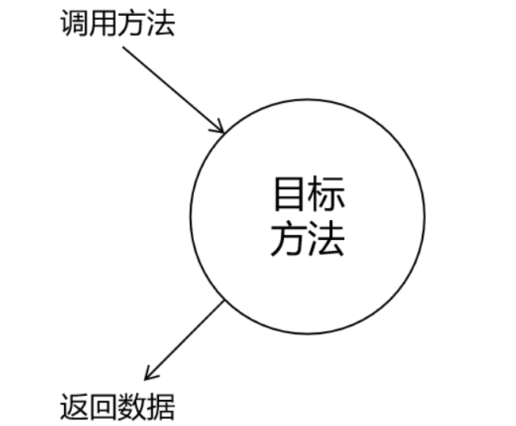

使用代理后

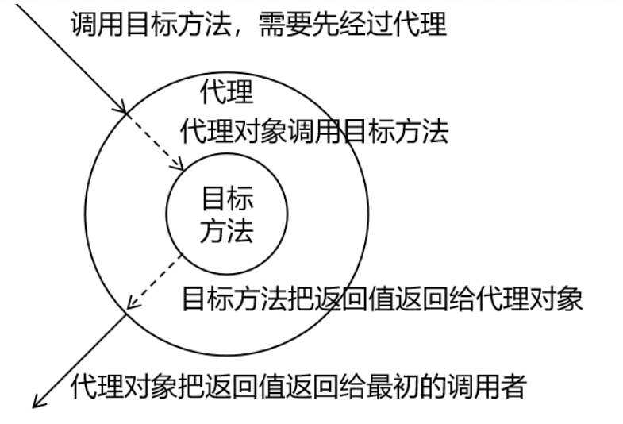

**②生活中的代理**

广告商找大明星拍广告需要经过经纪人

合作伙伴找大老板谈合作要约见面时间需要经过秘书

房产中介是买卖双方的代理

**③相关术语**

代理：将非核心逻辑剥离出来以后，封装这些非核心逻辑的类、对象、方法。

目标：被代理“套用”了非核心逻辑代码的类、对象、方法。

##### 3.2.2、静态代理

```java
public class CalculatorStaticProxy implements Calculator{

    // 将被代理的目标对象声明为成员变量
    private Calculator target;

    public CalculatorStaticProxy(Calculator target) {
        this.target = target;
    }

    @Override
    public int add(int i, int j) {
        int addResult = 0;
        try {
            // 附加功能由代理类中的代理方法来实现
            System.out.println("[日志] add 方法开始了，参数是：" + i + "," + j);

            addResult = target.add(i, j);

            // 通过目标对象来实现核心业务逻辑
            System.out.println("[日志] add 方法结束了，结果是：" + addResult);
        } catch (Exception e) {
            e.printStackTrace();
        } finally {

        }
        return addResult;
    }
}
```

静态代理确实实现了解耦，但是由于代码都写死了，完全不具备任何的灵活性。就拿日志功能来说，将来其他地方也需要附加日志，那还得再声明更多个静态代理类，那就产生了大量重复的代码，日志功能还是分散的，没有统一管理。

提出进一步的需求：将日志功能集中到一个代理类中，将来有任何日志需求，都通过这一个代理

类来实现。这就需要使用动态代理技术了。

##### 3.2.3、动态代理

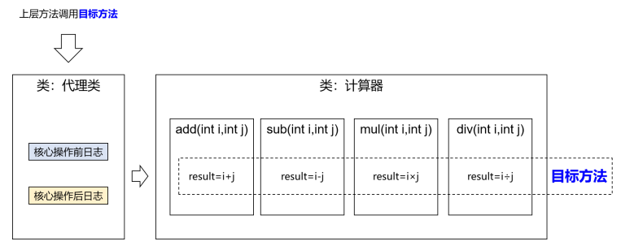

代理工厂类

```java
public class ProxyFactory {

    private Object target;

    public ProxyFactory(Object target) {
        this.target = target;
    }

    public Object getProxy(){

        /**
         * ClassLoader loader：指定加载动态生成的代理类的类加载器
         * Class[] interfaces：获取目标对象实现的所有接口的class对象的数组
         * InvocationHandler h：设置代理类中的抽象方法如何重写
         */
        ClassLoader loader = ProxyFactory.class.getClassLoader();

        Class<?>[] interfaces = target.getClass().getInterfaces();

        InvocationHandler h = new InvocationHandler() {
            @Override
            public Object invoke(Object proxy, Method method, Object[] args) throws Throwable {
                Object result = null;
                try {
                    System.out.println("日志，方法：" + method.getName() + ",参数：" + Arrays.toString(args));

                    //proxy:表示代理对象，method表示要执行的方法，args表示要执行的方法的参数列表
                    result = method.invoke(target, args);

                    System.out.println("日志，方法：" + method.getName() + ",结果：" + result);
                } catch (Exception e) {
                    e.printStackTrace();
                    System.out.println("日志，方法：" + method.getName() + ",异常：" + e);
                } finally {
                    System.out.println("日志，方法：" + method.getName() + ",方法执行完毕");
                }
                return result;
            }
        };

        return Proxy.newProxyInstance(loader,interfaces,h);
    }
}
```

##### 3.2.4、测试

```java
public class ProxyTest {

    /**
     * 静态代理
     */
    @Test
    public void testProxy(){
        CalculatorStaticProxy proxy = new CalculatorStaticProxy(new CalculatorImpl());

        proxy.add(1,2);
    }
    /**
     * 动态代理有两种：
     * 1、jdk动态代理，要求必须有接口，最终生成的代理类在和目标实现相同的接口
     * 在com.sun.proxy包下，类型为$proxy2
     * 2、cglib动态代理，最终生成的代理类会继承目标类，并且和目标类在相同的包下
     *
     */
    @Test
    public void testProxyFactory(){
        ProxyFactory proxyFactory = new ProxyFactory(new CalculatorImpl());

        Calculator proxy = (Calculator) proxyFactory.getProxy();

        proxy.div(1,0);
    }
}
```

#### 3.3、AOP和相关术语

##### 3.3.1、概述

AOP（Aspect Oriented Programming）是一种设计思想，是软件设计领域中的面向切面编程，它是面向对象编程的一种补充和完善，它以通过预编译方式和运行期动态代理方式实现在不修改源代码的情况下给程序动态统一添加额外功能的一种技术。

##### 3.3.2、相关术语

**①横切关注点**

从每个方法中抽取出来的同一类非核心业务。在同一个项目中，我们可以使用多个横切关注点对相关方法进行多个不同方面的增强。

这个概念不是语法层面天然存在的，而是根据附加功能的逻辑上的需要：有十个附加功能，就有十个横切关注点。

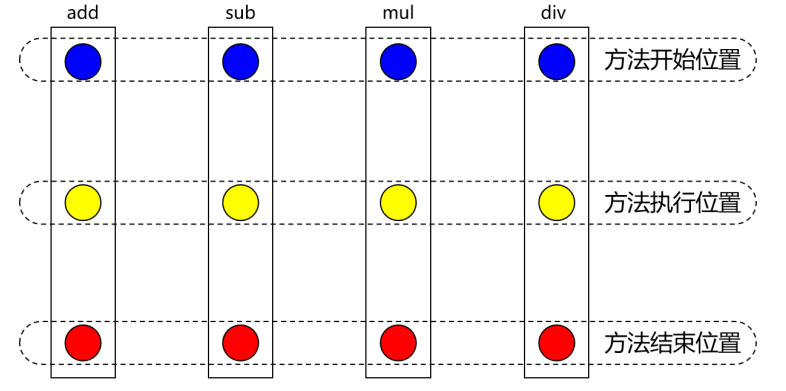

**②通知**

每一个横切关注点上要做的事情都需要写一个方法来实现，这样的方法就叫通知方法。

- 前置通知：在被代理的目标方法**前**执行
- 返回通知：在被代理的目标方法**成功结束**后执行（**寿终正寝**）
- 异常通知：在被代理的目标方法**异常结束**后执行（**死于非命**）
- 后置通知：在被代理的目标方法**最终结束**后执行（**盖棺定论**）
- 环绕通知：使用try...catch...finally结构围绕**整个**被代理的目标方法，包括上面四种通知对应的所有位置

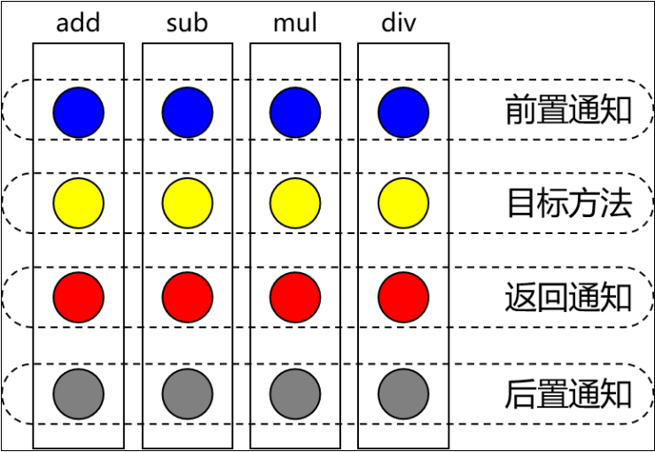

**③切面**

封装通知方法的类。

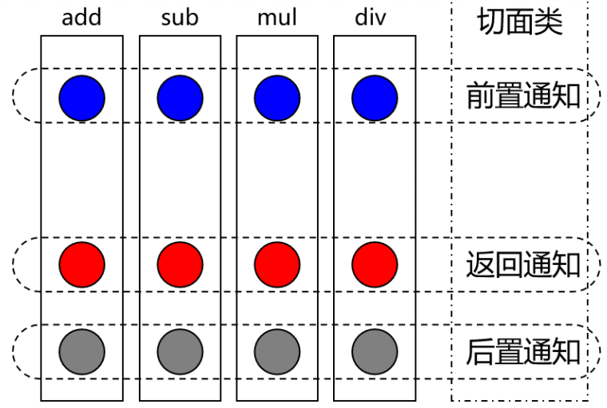

**④目标**

被代理的目标对象。

**⑤代理**

向目标对象应用通知之后创建的代理对象。

**⑥连接点**

这也是一个纯逻辑概念，不是语法定义的。

把方法排成一排，每一个横切位置看成x轴方向，把方法从上到下执行的顺序看成y轴，x轴和y轴的交叉

点就是连接点。

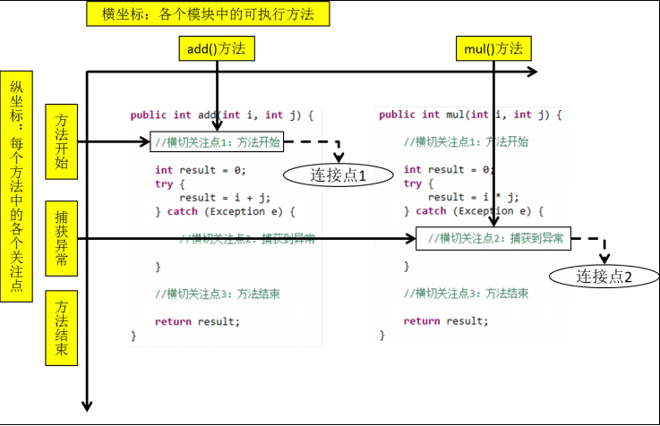

**⑦切入点**

定位连接点的方式。

每个类的方法中都包含多个连接点，所以连接点是类中客观存在的事物（从逻辑上来说）。

如果把连接点看作数据库中的记录，那么切入点就是查询记录的 SQL 语句。

Spring 的 AOP 技术可以通过切入点定位到特定的连接点。

切点通过 org.springframework.aop.Pointcut 接口进行描述，它使用类和方法作为连接点的查询条件。

##### 3.3.3、作用

简化代码：把方法中固定位置的重复的代码**抽取**出来，让被抽取的方法更专注于自己的核心功能，提高内聚性。

代码增强：把特定的功能封装到切面类中，看哪里有需要，就往上套，被**套用**了切面逻辑的方法就被切面给增强了。

#### 3.4、基于注解的AOP

##### 3.4.1、技术说明

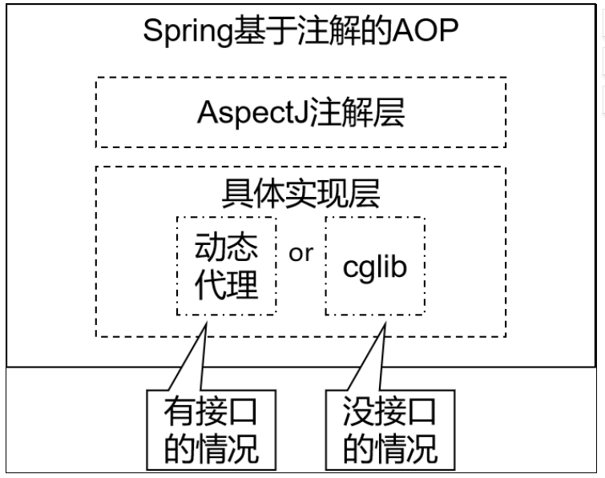

- 动态代理（InvocationHandler）：JDK原生的实现方式，需要被代理的目标类必须实现接口。因为这个技术要求**代理对象和目标对象实现同样的接口**（兄弟两个拜把子模式）。

- cglib：通过**继承被代理的目标类**（认干爹模式）实现代理，所以不需要目标类实现接口。

- AspectJ：本质上是静态代理，**将代理逻辑****“****织入****”****被代理的目标类编译得到的字节码文件**，所以最终效果是动态的。weaver就是织入器。Spring只是借用了AspectJ中的注解。

##### 3.4.2、准备工作

**①添加依赖**

```xml
<dependencies>
        <!-- 基于Maven依赖传递性，导入spring-context依赖即可导入当前所需所有jar包 -->
        <dependency>
            <groupId>org.springframework</groupId>
            <artifactId>spring-context</artifactId>
            <version>5.3.1</version>
        </dependency>

        <!-- junit测试 -->
        <dependency>
            <groupId>junit</groupId>
            <artifactId>junit</artifactId>
            <version>4.12</version>
            <scope>test</scope>
        </dependency>

        <!-- spring-aspects会帮我们传递过来aspectjweaver -->
        <dependency>
            <groupId>org.springframework</groupId>
            <artifactId>spring-aspects</artifactId>
            <version>5.3.1</version>
        </dependency>
    </dependencies>
```

**②准备被代理的目标资源**

接口：

```java
public interface Calculator {

    int add(int i, int j);

    int sub(int i, int j);

    int mul(int i, int j);

    int div(int i, int j);
}
```

接口实现类：

```java
@Component
public class CalculatorImpl implements Calculator{
    @Override
    public int add(int i, int j) {

        int result = i + j;

        System.out.println("方法内部 result = " + result);

        return result;
    }

    @Override
    public int sub(int i, int j) {

        int result = i - j;

        System.out.println("方法内部 result = " + result);

        return result;
    }

    @Override
    public int mul(int i, int j) {

        int result = i * j;

        System.out.println("方法内部 result = " + result);

        return result;
    }

    @Override
    public int div(int i, int j) {

        int result = i / j;

        System.out.println("方法内部 result = " + result);

        return result;
    }
}

```

##### 3.4.3、创建切面类

```java
@Component
@Aspect //将当前组件标识为切面组件
public class LoggerAspect{

    @Pointcut("execution(* com.tzadok.spring.aop.annotation.CalculatorImpl.*(..))")
    public void pointCut(){
        //公共的切入点表达式
    }

    //@Before("execution(public int com.tzadok.spring.aop.annotation.CalculatorImpl.add(int ,int ))")
    @Before("pointCut()")
    public void beforeAdviceMethod(JoinPoint joinPoint){

        //获取连接点对应的签名信息
        Signature signature = joinPoint.getSignature();
        //获取连接点所对应的方法的参数
        Object[] args = joinPoint.getArgs();

        System.out.println("LoggerAspect,前置通知,方法：" + signature.getName() + ",参数:" + Arrays.toString(args));
    }


    @After("pointCut()")
    public void afterAdviceMethod(JoinPoint joinPoint){

        Signature signature = joinPoint.getSignature();

        System.out.println("LoggerAspect,后置通知,方法：" + signature.getName() + ",执行完毕");
    }

    /**
     * 在返回通知中若要获取目标对象方法的返回值，只需要通过@AfterReturning注解的returning属性，
     * 就可以将通知方法的某个参数指定为接收目标对象方法的返回值的参数
     * @param joinPoint
     * @param result
     */
    @AfterReturning(value = "pointCut()",returning = "result")
    public void afterReturningAdviceMethod(JoinPoint joinPoint,Object result){

        Signature signature = joinPoint.getSignature();

        System.out.println("LoggerAspect,返回通知,方法：" + signature.getName() + ",结果:" + result);

    }

    /**
     * 在返回通知中若要获取目标对象方法的返回值，只需要通过@AfterThrowing注解的throwing属性，
     * 就可以将通知方法的某个参数指定为接收目标对象方法的异常的参数
     * @param joinPoint
     * @param ex
     */
    @AfterThrowing(value = "pointCut()",throwing = "ex")
    public void afterThrowingAdviceMethod(JoinPoint joinPoint,Throwable ex){

        Signature signature = joinPoint.getSignature();

        System.out.println("LoggerAspect,异常通知,方法：" + signature.getName() + ",异常:" + ex);

    }

    /**
     * 环绕通知
     */
    @Around("pointCut()")
    //环绕通知的方法的返回值一定要和目标对象方法的返回值一致
    public Object aroundAdviceMethod(ProceedingJoinPoint joinPoint){
        Object result = null;
        try {
            System.out.println("环绕通知-->前置通知");
            //表示目标对象的执行
            result = joinPoint.proceed();
            System.out.println("环绕通知-->返回通知");
        } catch (Throwable e) {
            e.printStackTrace();
            System.out.println("环绕通知-->异常通知");
        } finally {
            System.out.println("环绕通知-->后置通知");
        }
        return result;
    }

}
```

在Spring的配置文件中配置：

```xml
    <!--
        AOP的注意事项：
        切面类和目标类都需要交给IOC容器
        切面类必须通过@Aspect注解标识为一个切面
        在spring的配置文化中设置<aop:aspectj-autoproxy />，开启基于注解的AOP
    -->

    <context:component-scan base-package="com.tzadok.spring.aop.annotation"></context:component-scan>

    <!--开启基于注解的aop    -->
    <aop:aspectj-autoproxy />
```

##### 3.4.4、各种通知

- 前置通知：使用@Before注解标识，在被代理的目标方法**前**执行
- 返回通知：使用@AfterReturning注解标识，在被代理的目标方法**成功结束**后执行（**寿终正寝**）
- 异常通知：使用@AfterThrowing注解标识，在被代理的目标方法**异常结束**后执行（**死于非命**）
- 后置通知：使用@After注解标识，在被代理的目标方法**最终结束**后执行（**盖棺定论**）
- 环绕通知：使用@Around注解标识，使用try...catch...finally结构围绕**整个**被代理的目标方法，包括上面四种通知对应的所有位置

各种通知的执行顺序：

**Spring版本5.3.x以前：**

- 前置通知
- 目标操作
- 后置通知
- 返回通知或异常通知

**Spring版本5.3.x以后：**

- 前置通知
- 目标操作
- 返回通知或异常通知
- 后置通知

##### 3.4.5、切入点表达式

①作用

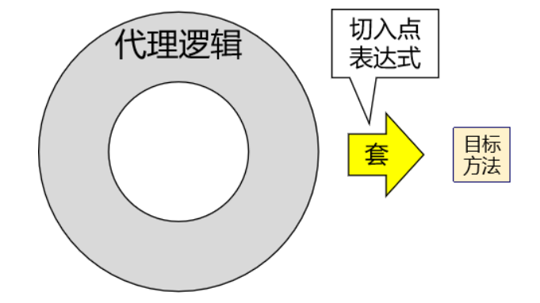

**②语法细节**

- 用*号代替“权限修饰符”和“返回值”部分表示“权限修饰符”和“返回值”不限
- 在包名的部分，一个“*”号只能代表包的层次结构中的一层，表示这一层是任意的。

​				例如：*.Hello匹配com.Hello，不匹配com.atguigu.Hello

- 在包名的部分，使用“*..”表示包名任意、包的层次深度任意
- 在类名的部分，类名部分整体用*号代替，表示类名任意
- 在类名的部分，可以使用*号代替类名的一部分

​				例如：*Service匹配所有名称以Service结尾的类或接口

- 在方法名部分，可以使用*号表示方法名任意
- 在方法名部分，可以使用*号代替方法名的一部分

​				例如：*Operation匹配所有方法名以Operation结尾的方法

- 在方法参数列表部分，使用(..)表示参数列表任意
- 在方法参数列表部分，使用(int,..)表示参数列表以一个int类型的参数开头
- 在方法参数列表部分，基本数据类型和对应的包装类型是不一样的

​				切入点表达式中使用 int 和实际方法中 Integer 是不匹配的

- 在方法返回值部分，如果想要明确指定一个返回值类型，那么必须同时写明权限修饰符

​				例如：execution(public int *..*Service.*(.., int)) 正确

​				例如：execution(* int *..*Service.*(.., int)) 错误

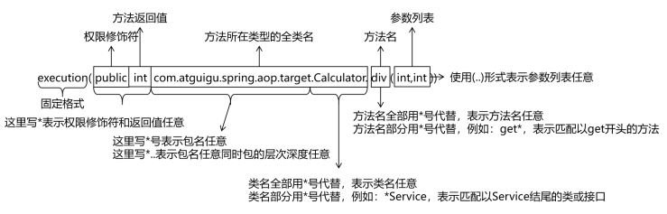

##### 3.4.6、复用切入点表达式

①声明

```java
@Pointcut("execution(* com.tzadok.spring.aop.annotation.CalculatorImpl.*(..))")
public void pointCut(){
    //公共的切入点表达式
}
```

②在同一个切面中使用

```java
    @Before("pointCut()")
    public void beforeAdviceMethod(JoinPoint joinPoint){
        //获取连接点对应的签名信息
        Signature signature = joinPoint.getSignature();
        //获取连接点所对应的方法的参数
        Object[] args = joinPoint.getArgs();
        System.out.println("LoggerAspect,前置通知,方法：" + signature.getName() + ",参数:" + Arrays.toString(args));
    }
```

③在不同切面中使用

```java
public class ValidateAspect {

//    @Before("execution(* com.tzadok.spring.aop.annotation.CalculatorImpl.*(..))")
    @Before("com.tzadok.spring.aop.annotation.LoggerAspect.pointCut()")
    public void beforeMethod(){
        System.out.println("ValidateAspect---->前置通知");
    }
}
```

##### 3.4.7、获取通知的相关信息

**①获取连接点信息**

获取连接点信息可以在通知方法的参数位置设置JoinPoint类型的形参

```java
@After("pointCut()")
public void afterAdviceMethod(JoinPoint joinPoint){
    Signature signature = joinPoint.getSignature();
    System.out.println("LoggerAspect,后置通知,方法：" + signature.getName() + ",执行完毕");
}
```

**②获取目标方法的返回值**

@AfterReturning中的属性returning，用来将通知方法的某个形参，接收目标方法的返回值

```java
    /**
     * 在返回通知中若要获取目标对象方法的返回值，只需要通过@AfterReturning注解的returning属性，
     * 就可以将通知方法的某个参数指定为接收目标对象方法的返回值的参数
     * @param joinPoint
     * @param result
     */
    @AfterReturning(value = "pointCut()",returning = "result")
    public void afterReturningAdviceMethod(JoinPoint joinPoint,Object result){
        Signature signature = joinPoint.getSignature();
        System.out.println("LoggerAspect,返回通知,方法：" + signature.getName() + ",结果:" + result);
    }
```

**③获取目标方法的异常**

@AfterThrowing中的属性throwing，用来将通知方法的某个形参，接收目标方法的异常

```java
    /**
     * 在返回通知中若要获取目标对象方法的返回值，只需要通过@AfterThrowing注解的throwing属性，
     * 就可以将通知方法的某个参数指定为接收目标对象方法的异常的参数
     * @param joinPoint
     * @param ex
     */
    @AfterThrowing(value = "pointCut()",throwing = "ex")
    public void afterThrowingAdviceMethod(JoinPoint joinPoint,Throwable ex){
        Signature signature = joinPoint.getSignature();
        System.out.println("LoggerAspect,异常通知,方法：" + signature.getName() + ",异常:" + ex);
    }
```

##### 3.4.8、环绕通知

```java
    /**
     * 环绕通知
     */
    @Around("pointCut()")
    //环绕通知的方法的返回值一定要和目标对象方法的返回值一致
    public Object aroundAdviceMethod(ProceedingJoinPoint joinPoint){
        Object result = null;
        try {
            System.out.println("环绕通知-->前置通知");
            //表示目标对象的执行
            result = joinPoint.proceed();
            System.out.println("环绕通知-->返回通知");
        } catch (Throwable e) {
            e.printStackTrace();
            System.out.println("环绕通知-->异常通知");
        } finally {
            System.out.println("环绕通知-->后置通知");
        }
        return result;
    }
```

##### 3.4.9、切面的优先级

相同目标方法上同时存在多个切面时，切面的优先级控制切面的**内外嵌套**顺序。

- 优先级高的切面：外面
- 优先级低的切面：里面

使用@Order注解可以控制切面的优先级：

- @Order(较小的数)：优先级高
- @Order(较大的数)：优先级低

#### 3.5、基于XML的AOP（了解）

##### 3.5.1、准备工作

①导入依赖

②创建接口、接口实现类、切面类

##### 3.5.2、实现

```xml
<aop:config>
        <aop:pointcut id="pointCut" expression="execution(* com.tzadok.spring.aop.xml.CalculatorImpl.*(..))"/>
        <!--  将IOC容器中的某个bean设置为切面      -->
        <aop:aspect ref="loggerAspect">
            <aop:before method="beforeAdviceMethod" pointcut-ref="pointCut"></aop:before>
            <aop:after method="afterAdviceMethod" pointcut-ref="pointCut"></aop:after>
            <aop:after-returning method="afterReturningAdviceMethod" pointcut-ref="pointCut" returning="result"></aop:after-returning>
            <aop:after-throwing method="afterThrowingAdviceMethod" pointcut-ref="pointCut" throwing="ex"></aop:after-throwing>
            <aop:around method="aroundAdviceMethod" pointcut-ref="pointCut"></aop:around>
        </aop:aspect>

        <aop:aspect ref="validateAspect" order="1">
            <aop:before method="beforeMethod" pointcut-ref="pointCut"></aop:before>
        </aop:aspect>
    </aop:config>
```

